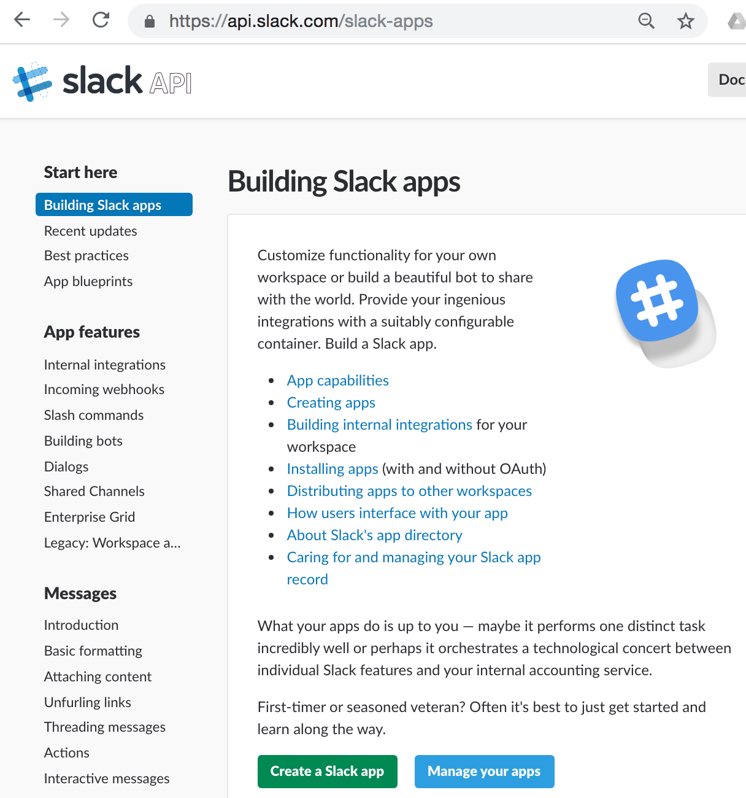
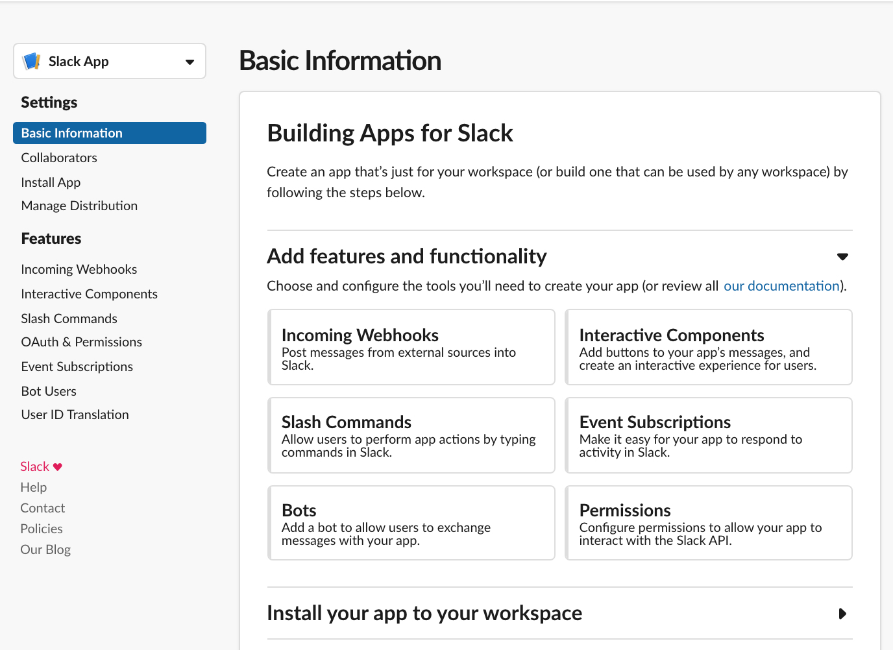
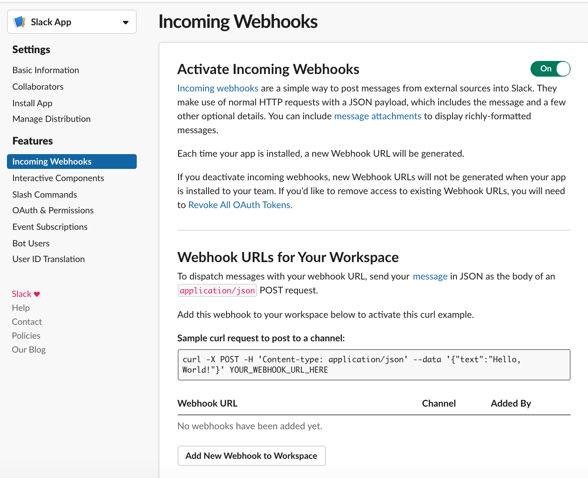
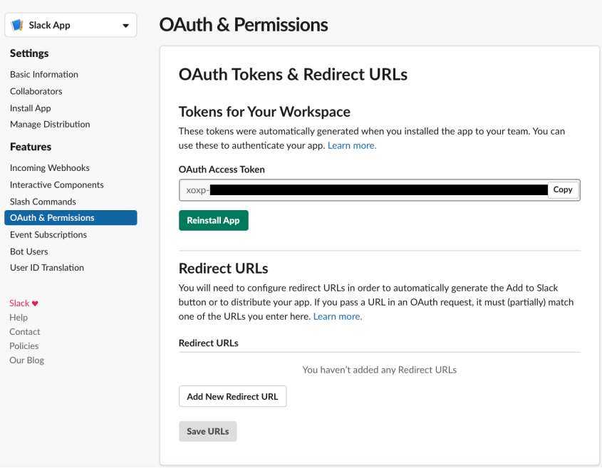
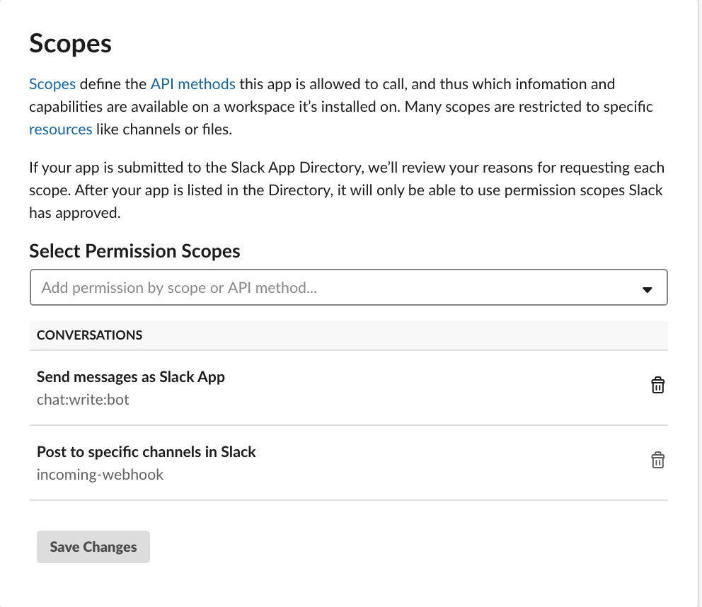

# Post from R to Slack

When I schedule R scripts to run every day or week I like to keep track of them without having to dig through logs and files. This can be done using an app called `slackr` which allows the code to post to a Slack channel.

To set this up the following steps have to be followed:
- go to https://api.slack.com/slack-apps to set up the slack-API and webhook

- Click on the green button `Create Slack App`
- go to `Basic Information` in the menu on the left

- Click on `Incoming Webhooks`
- Move the slider by `Activate Incoming Webhooks` to `On`

- Click on `Add New Webhook to Workspace
- On the screen that comes up you should see a `Post to` section with a dropdown menu, chose there what channel you would like to post do (for demonstration purposes I chose `Slackbot, which is private to you`)
- Click the green button (`Authorize`), this will return you to the `Incoming Webhooks` screen where the `Webhook URL` section now has an entry starting with `https://hooks.slack.com/services/...`

- Return to `Basic Information` and click on `Add features and functionality` and click on `Permissions`, this will retired you to the `OAuth & Permissions` screen. The first section gives you the OAuth Access Token which is not needed in R but needed in Python.

- Scroll down to `Scopes` and in `Select Permission Scopes` add type `chat:write:bot` into the `Add permission by scope or API method` dropdown menu.
- Click on `Save Changes`, which will prompt you to Reinstall the App, click on the link and get redirected to the same screen as before, again chose which channel you want to post to and `Authorize`.

**Viola, the Slack API is set up**

